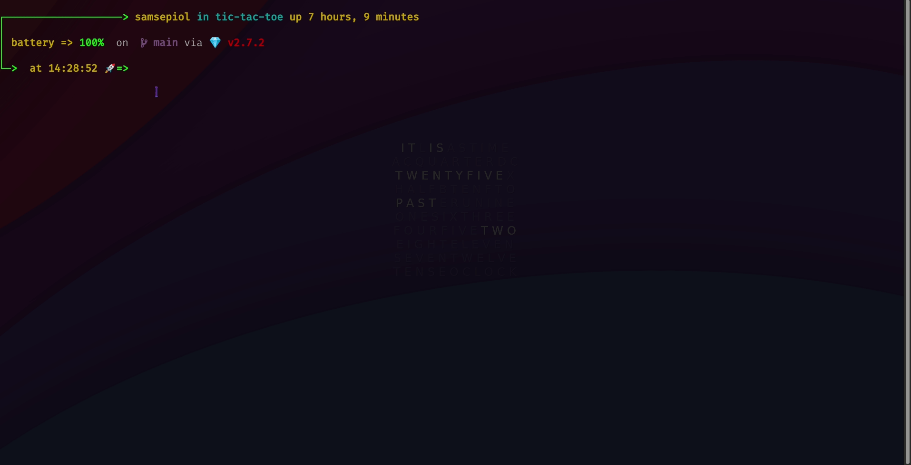

# Ruby_TicTacToe
This project is from [The Odin Project](https://www.theodinproject.com/courses/ruby-programming/lessons/oop)
 
See Live: [Repl](https://replit.com/@TheGeek2/tic-tac-toe)

 
_This project's previous commits are located in another github repository. I currently separated this from there._
